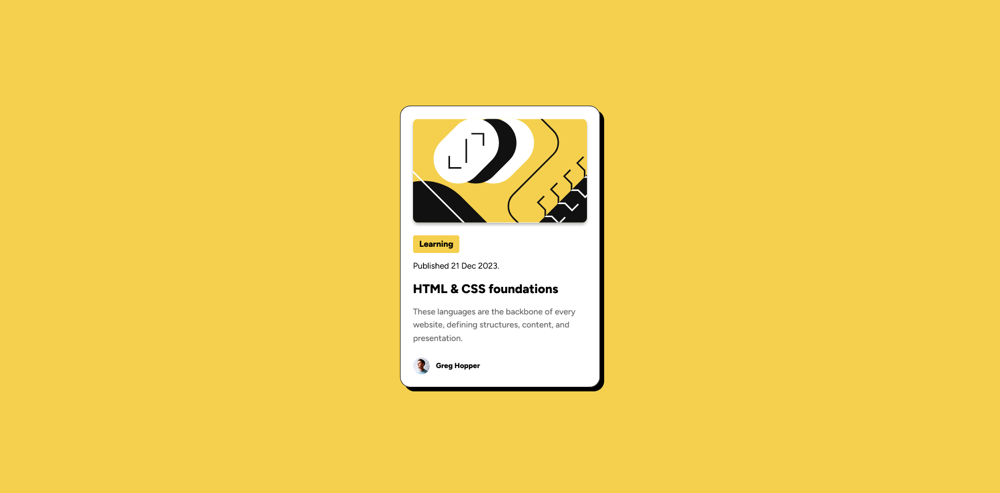

# BLOGR LANDING PAGE DESIGN

This project is meant for building practicing my css skills to a better level and the code I have written is purely css and html.

## CSS Files

In this project I learned to manage CSS coding through different files and building my own CSS framework and rules to get completed the project.

In **queries.css**, we have

```
@media (max-width: 420px) {
    html {
        font-size: 8px
    }

    .card {
        padding: 12px;
    }
}
```
